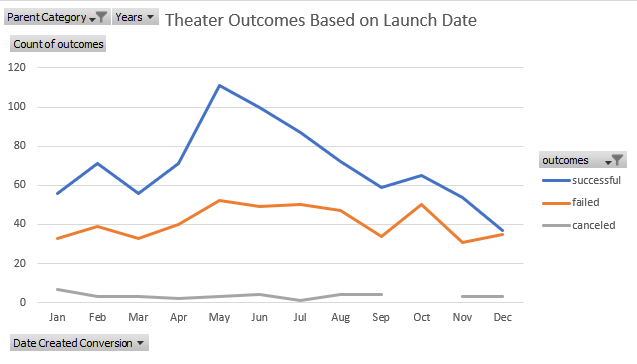
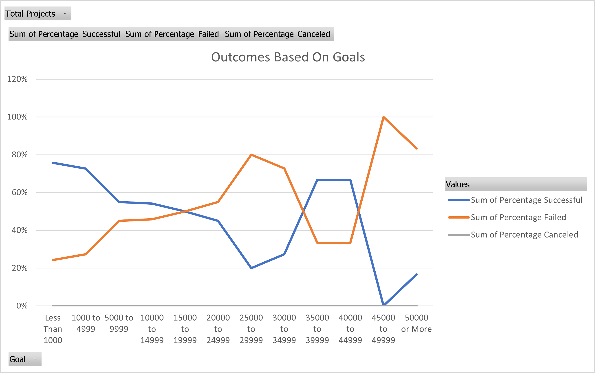

# kickstarter-analysis
Performing analysis on Kickstarter data to uncover trends/.

## **Kickstarter Project Overview**

Louise is looking for more information through Kickstarter data to ascertain the probability of succeeding in raising funds for her next production.

## **Analysis and Challenges**

We were tasked with working through the data to determine a more specific sample for Louise to review. This included narrowing search parameters by goals, type of fundraiser, location, and success/fail rates. 

## **Findings of Outcomes Based on Launch Date**

The findings suggested that productions are mor successful during specific seasons, particularly summertime, which could directly correlate with families having time to go out for extracurricular activties when their children are not in school, etc. Other factors could include weather conditions and holidays. 

#### Pivot Chart Data

## **Findings of Outcomes Based on Goal**
	
The findings of how outcomes are affected by the Goal of the Kickstarter highly depended on how much the goal was for the individual production. With that, I believe that the location of the production is key as well. While a $45,000 goal could fail in a small Wisconsin town, it could easily double or triple itself in New York City. The data seems to be scattered in relation to success or fail rate (since none were canceled)... most productions up to $4,999 had a minimum 73% success rate, while the $25,000-$29,999 range had an 80% fail rate, and above that, sitting at $35,000-$44,999 only had a 33% fail rate between them. However, it is pretty fair to say that any plays with goals in excess of $45,000 have a fail rate of 83%-100%.

#### Pivot Chart Data

## **Data Set Limitations**
Some of the limitations within the data set include: 
	- Not knowing the specific area of the country the production is taking place. 
	- Not knowing the demographics of the patrons. 
	- Not knowing ticket prices/parking prices for the production. 
	- Not knowing the days and times the production is taking place (for instance, a Friday evening production would more than likely do better than a Tuesday evening production). 

## **Summary**

Overall, this analysis was very inciteful and supplied enough information for Louise to draw her conclusions. While the data could have been more specific, it is enough to create a broadly stroked idea of what will be successful and what will fail. 
